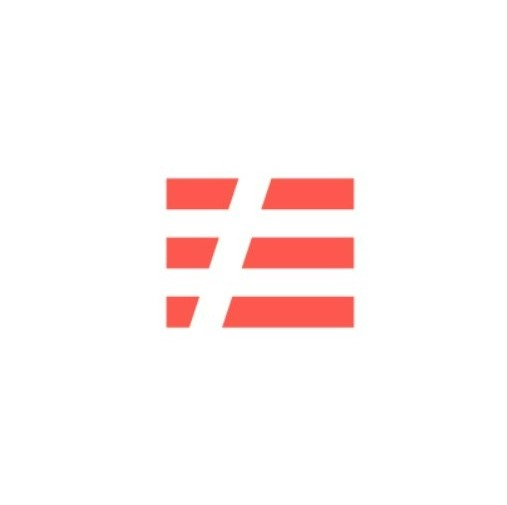
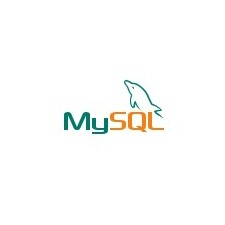

<h2 style="text-align: center;">저는 주로 이것을 사용합니다</h2>

    

        <!-- AWS -->
        

            
            <h4 class="service-heading">
AWS
</h4>
            
Click to view details

            

                

                    AWS 아키텍처를 구성한 뒤, 직접 생성하고 연결할 수 있습니다. 보안을 위해 VPC 및 서브넷을 생성하고, 역할과 정책을 구성할 수 있습니다.
                

            

        

        <!-- JavaScript -->
        

            
            <h4 class="service-heading">
JavaScript
</h4>
            
Click to view details

            

                

                    JavaScript를 이용하여 웹사이트의 동적인 요소를 구현해 본 경험이 있습니다. Node.js를 사용하여 서버 사이드 애플리케이션을 구현해 본 경험이 있습니다.
                

            

        

        <!-- Kubernetes -->
        

            
            <h4 class="service-heading">
Kubernetes
</h4>
            
Click to view details

            

                

                    Kubernetes 클러스터를 구성하고, 파드, 서비스, 볼륨 등의 리소스를 관리할 수 있습니다. Docker 컨테이너 기술을 이용하는 애플리케이션을 구성하고 배포해 본 경험이 있습니다.
                

            

        

        <!-- Linux -->
        

            
            <h4 class="service-heading">
Linux
</h4>
            
Click to view details

            

                

                    Linux 커맨드 라인 인터페이스(CLI)를 이용하여 파일 및 디렉토리 작업, 패키지 설치, 서비스 제어 등을 수행할 수 있습니다. Linux에서 사용되는 Ubuntu를 설치하고 구성하는 방법을 알고 있습니다.
                

            

        

        <!-- Terraform -->
        

            
            <h4 class="service-heading">
Terraform
</h4>
            
Click to view details

            

                

                    Terraform을 이용하여 AWS의 클라우드 서비스를 구성하고 프로비저닝할 수 있습니다. Terraform을 사용하여 IaC(Infrastructure as Code)를 구현하고, 인프라스럭처의 버전 관리 및 변경 이력 추적을 할 수 있습니다.
                

            

        

        <!-- Visual Studio Code -->
        

            
            <h4 class="service-heading">
Visual Studio Code
</h4>
            
Click to view details

            

                

                    VS Code를 사용하여 코드 편집, 버전 관리, 플러그인 관리 등 다양한 작업을 수행할 수 있습니다. VS Code의 단축키와 명령어를 이용하여 더욱 효율적으로 코드 작업을 수행할 수 있습니다.
                

            

        

    

 
 
<h2 style="text-align: center;">저는 이것을 사용한 적이 있습니다</h2>

<!-- Second Container (New) -->

    

        <!-- New Skill 1 -->
        

            
            <h4 class="service-heading">
Apache
</h4>
        

        <!-- New Skill 2 -->
        

            
            <h4 class="service-heading">
NGINX
</h4>
        

        <!-- New Skill 3 -->
        

            
            <h4 class="service-heading">
Java Script
</h4>
        

        <!-- New Skill 4 -->
        

            
            <h4 class="service-heading">
Serverless  
</h4>
        

        <!-- New Skill 5 -->
        

            
            <h4 class="service-heading">
Express
</h4>
        

        <!-- New Skill 6 -->
        

            
            <h4 class="service-heading">
Fastify
</h4>
        

        <!-- New Skill 7 -->
        

            
            <h4 class="service-heading">
Postman
</h4>
        

        <!-- New Skill 8 -->
        

            
            <h4 class="service-heading">
GitHub Actions  
</h4>
        

        <!-- New Skill 9 -->
        

            
            <h4 class="service-heading">
MySQL
</h4>
        

        <!-- New Skill 10 -->
        

            
            <h4 class="service-heading">
MongoDB
</h4>
        

        <!-- New Skill 11 -->
        

            
            <h4 class="service-heading">
Prometheus
</h4>
        

        <!-- New Skill 12 -->
        

            
            <h4 class="service-heading">
Grafana
</h4>
        

    

